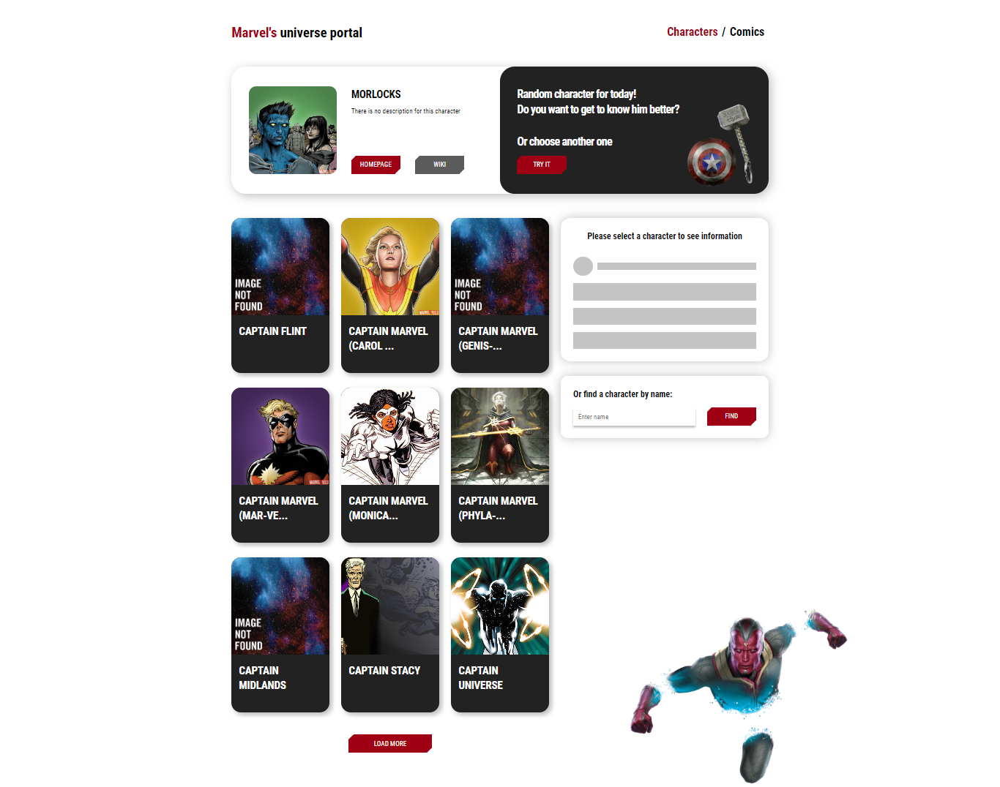
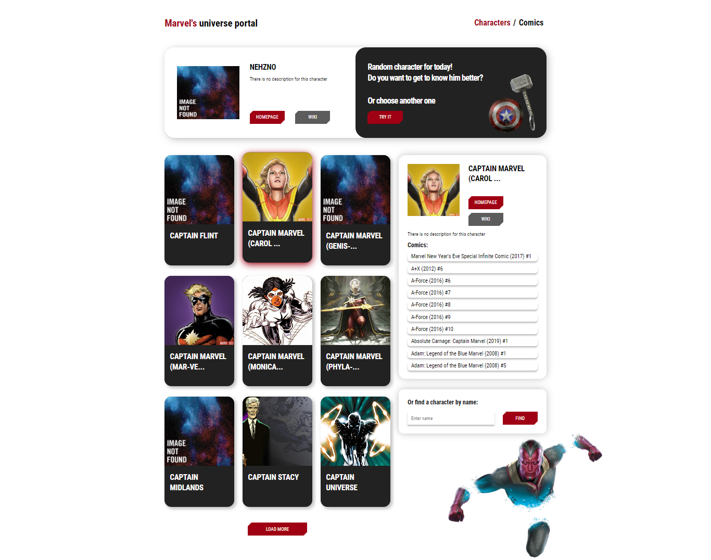
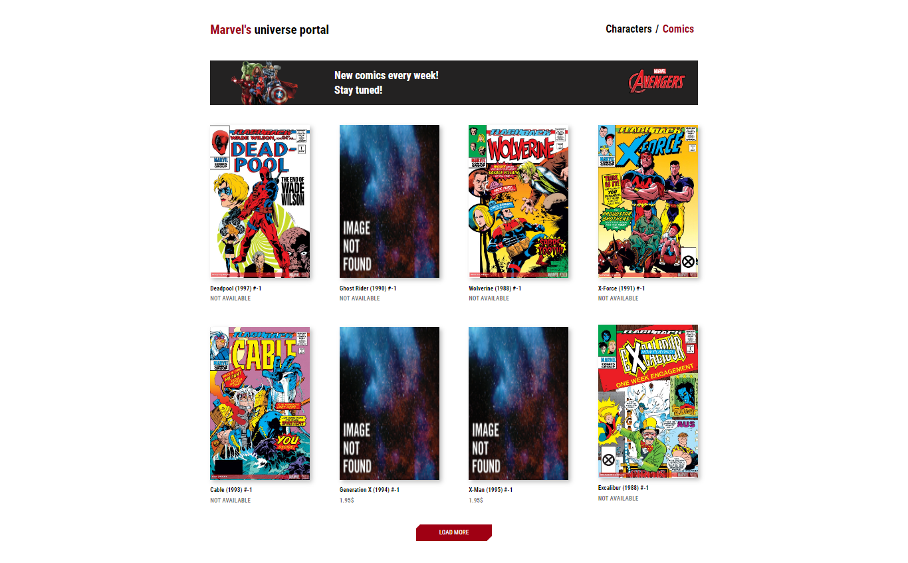
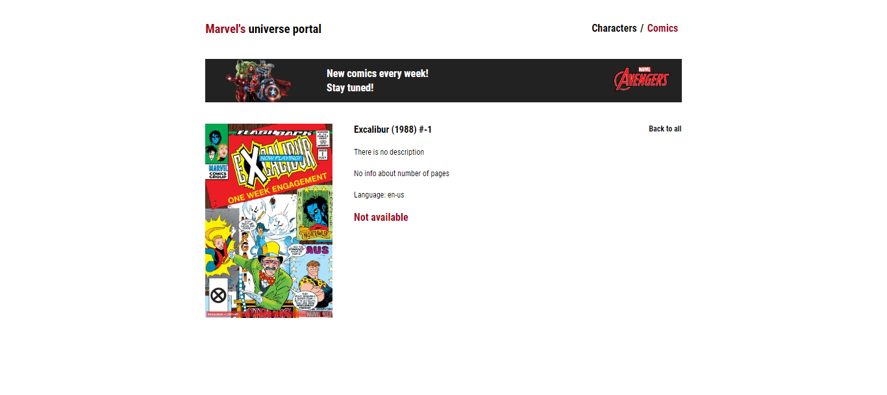

# marvel-api-app
-  Responsive React app to get  characters and comics based on Marvel Comics API
 
## General info
- In this app you can switch random characters, choose character, get info about him, appearances in comics, load more characters(at start you have only 9) or try to find character's you need and go to page about him/her. Also you can find here Comic's page where you'll get info about chosen comics

## Screenshots





## Used technologies:
React, React Hooks, Formik, React Router, SCSS

## Setup
To run this project, download and install it locally using npm:

```
$ npm install

```
